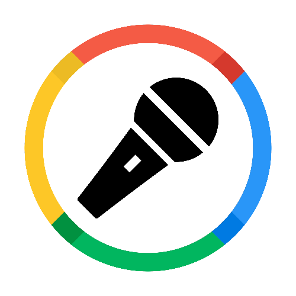

    

<h1 style="text-align: center;">KeepYourMouthShut</h1>

    

## 🎙️ Introduction

[KeepYourMouthShut](https://www.keepyourmouthshut.net/) is an app that aims to provide 360-degree solution for Podcasters. From writing the scripts to providing an unique voice, KeepYourMouthShut has the ability to produce an entire episode for your Podcast all by itself.

## 📑 Features

- Smart Script Creation
- Dynamic Voice Synthesis
- Continuous Enhancement
- Ad Integration and Monetization
- Comprehensive Support
- Cutting-Edge Tech Utilization

## 📷 Setup

Please find the latest `Docker` image from the [Release pages](https://github.com/rajtilakjee/keepyourmouthshut/releases).

## 🧑🏾‍🤝‍🧑🏻 Contributing

Contributions are welcome! Feel free to open an issue or submit a pull request if you have a way to improve this project.

Make sure your request is meaningful and you have tested the app locally before submitting a pull request.

Refer to [CONTRIBUTING.md](CONTRIBUTING.md) for more details on contributing, installing requirements, and running the application.

## 💸 Support

💙 If you like this project, give it a ⭐ and share it with friends! You may also consider sponsoring or backing this project.
